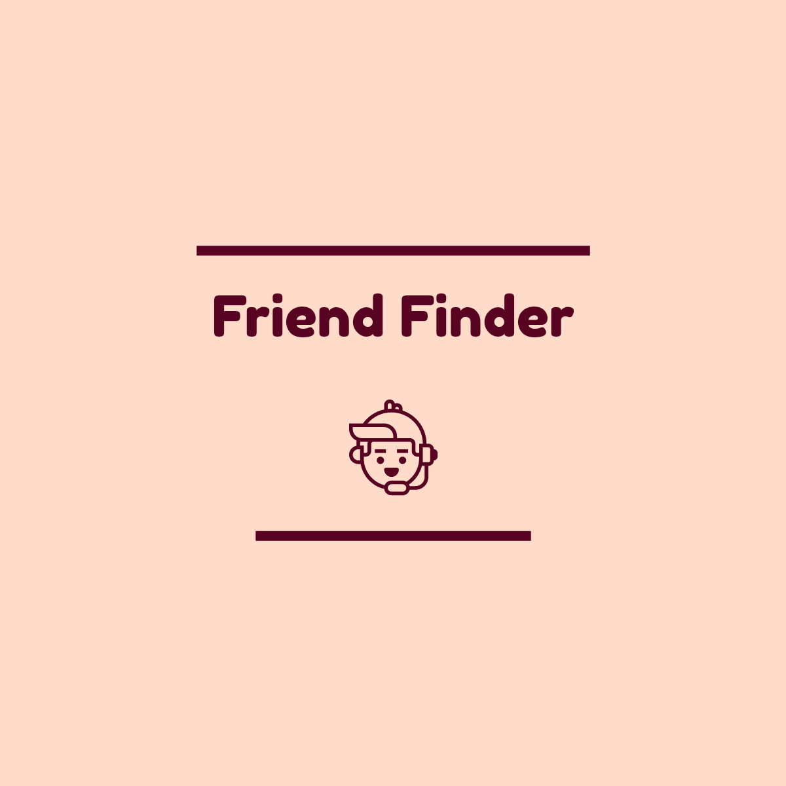
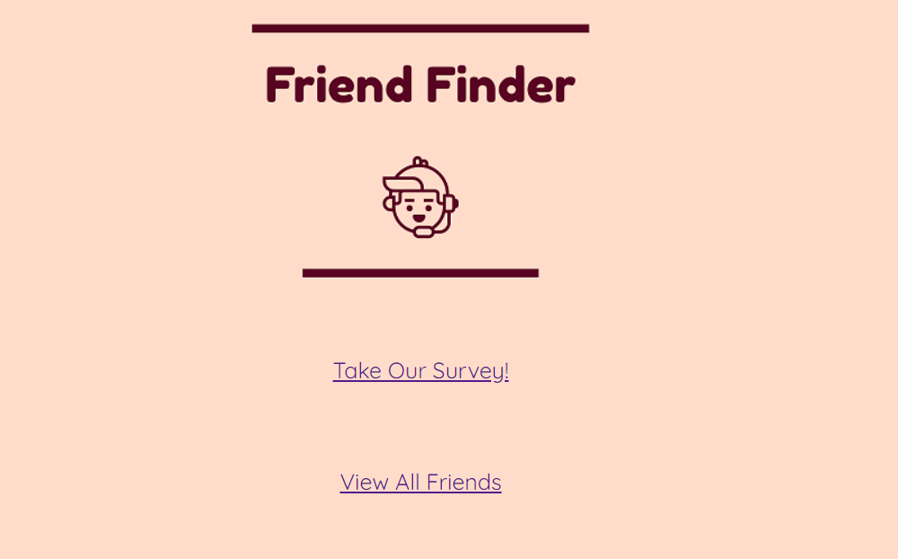
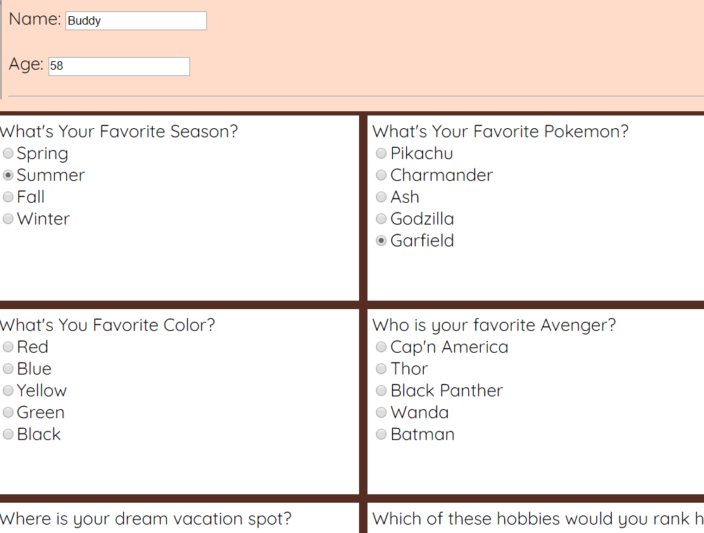
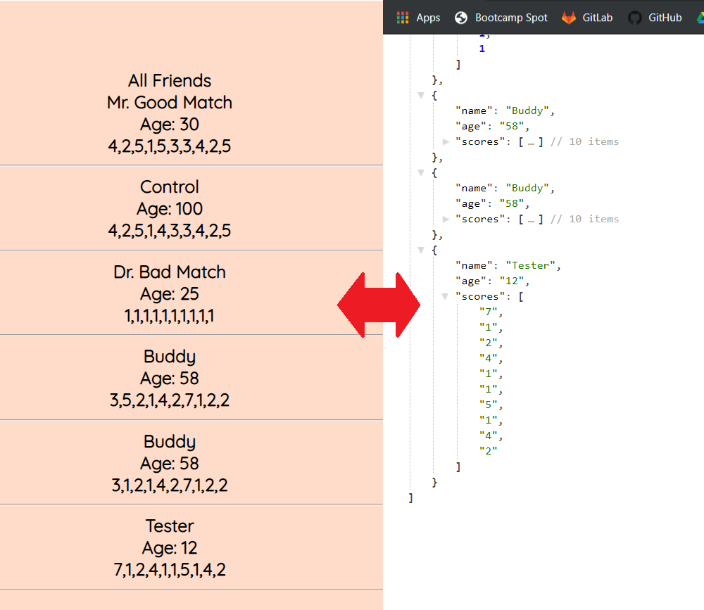

# FriendFinder



*Friend Finder* is a full-stack application utilizing Express routing to capture and compare user data, and match you to a new (virtual) friend. The app is hosted online through Heroku.

## Home Page



The landing page offers you two choices:

* **Survey** - Here you can take a short multiple choice test.
* **Friends** - This is an overview of the virtual friends you might match with.

## Survey



This page presents you with 10 simple questions that will capture your personality type. It is a basic form made using HTML and CSS, with the information being captured by jQuery. This user data is saved in the form of a JSON/api on the next page:

## Friends

Here we can see the virtual friends that were programmed into the application, and any new user data. They are displayed using API data and jQuery to make a simple entry for each. The html is a cleaner presentation of the user data api and updates as new entries are logged.



## Match Function

Here is the gist of the Javascript logic used to compare users. *FF* loops through the array of saved survey answers,comparing them with each of your answers. The difference between each answer is then totaled and if the score is below a predetermined number (20), you will get a match. This process is repeated though the entire database of friends.

```javascript
function matchMake() {
    $.get("/api/friends", function (data) {
        compareScore = 0;
        for (var i = 0; i < data.length; i++) {
            for (var o = 0; o < data[i].scores.length; o++) {
                fScore = data[i].scores[o];
                function diff(a, b) {return Math.abs(a - b);}
                total = diff(fScore, uScore[o]);
                compareScore += total;}
            if (compareScore <= 20) {console.log("You have a match!")}
            compareScore = 0;
        }})}                 
```
(This is an early draft of the function, it will go through more changes.)


The matches will be pushed to a new array that will be presented to the user, showcasing all of their potential friend matches!
